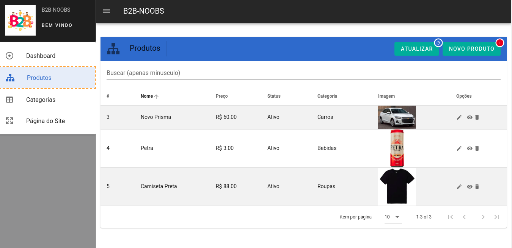
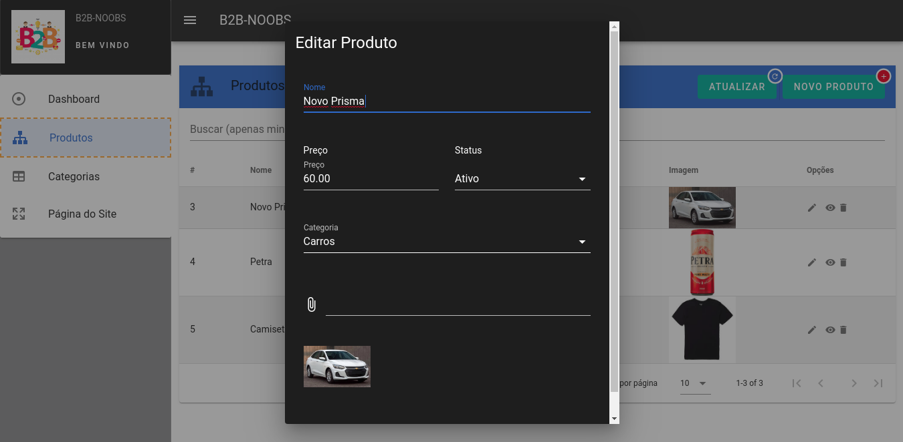
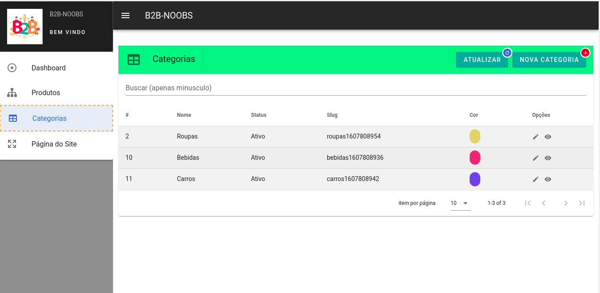
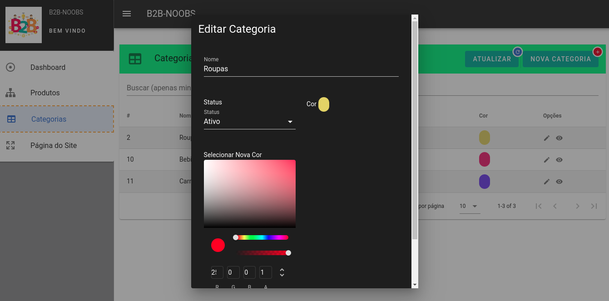
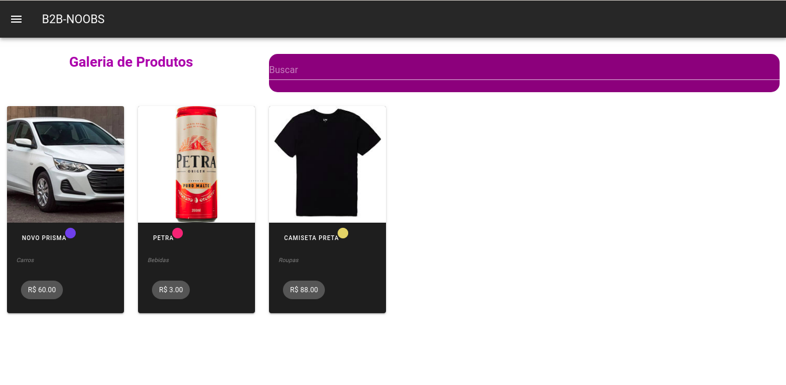

# Projeto teste Team B2B - b2b-noobs

#### Regras adicionais do Negócio:


** Para a gestão do projeto: Gitflow **
** As hards skills utilizadas são: PHP 7.4, MySql, Laravel 8, API, Composer, Vue.js, Axios **

---

##### Print das telas do projeto

<p align="center">
</p>

<p align="center">
</p>

<p align="center">
</p>

<p align="center">
</p>

<p align="center">
</p>

### Como iniciar o projeto:

+ O Laravel possui um conjunto de requisitos para funcionar perfeitamente em ambientes específicos. Esta seção específica - [requisítos do laravel](https://laravel.com/docs/7.x#server-requirements) - Laravel Documentação.

+ Para compilar o projeto é necessário ter instalado o [Composer](https://getcomposer.org/) , [Node](https://nodejs.org/) e [Yarn](https://yarnpkg.com/) em sua máquina.

Assumindo que sua máquina possua os requisitos listados - Vamos processar a instalação e compilar o projeto para ser executado.

+ Caso ainda não o tenha feito, clone este repositório com o Git 
```
git clone https://github.com/sergiaoprogramador/b2b-noobs.git
```

1. Abra no cmd ou aplicativo de terminal e navegue até esta pasta inicial do projeto

2. Execute os comandos a seguir para as configurações de backend:

#### Configurando o Backend:

+ Abra a pasta back 

```bash
composer install
```

```bash
cp .env.example .env
```
+ Configure as variaveis de Banco de dados no arquivo .env para configuração das tabelas (configure um Banco para fins de teste)

```bash
php artisan key:generate
```

```bash
php artisan migrate:fresh --seed
```

```bash
php artisan serve
```

+ Deixe o servidor rodando


2. Execute os comandos a seguir para as configurações de frontend:

#### Configurando o Frontend:

+ Abra um novo terminal de linha de comando e acesse a pasta front

```
yarn install
```

##### Compiles and hot-reloads for development
```
yarn serve
```

##### Compiles and minifies for production
```
yarn build
```

##### Lints and fixes files
```
yarn lint
```

##### Crie um arquivo .env a partir de .env.example
```
coloqe a url da api (url do servidor do laravel) em URL_API
digite o nome do projeto em PROJECT_NAME
```

##### Compile e Rode 
```
npm run dev

ou

npm run build (para producao)
```

### Componentes
Para os componentes utilizei o [BootstrapVue](https://bootstrap-vue.org/docs)
Para as validações utilizei o [VueValidate](https://vuelidate.js.org/)

### Copyright

Team ENE
